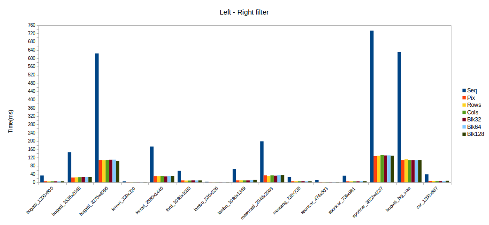
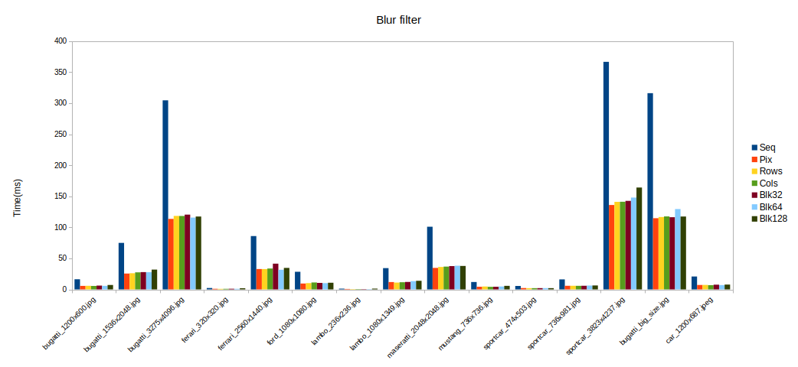
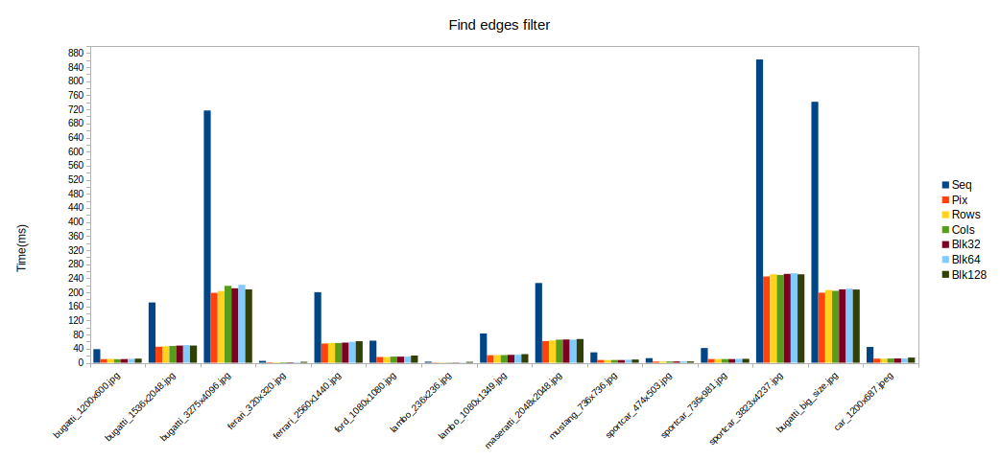
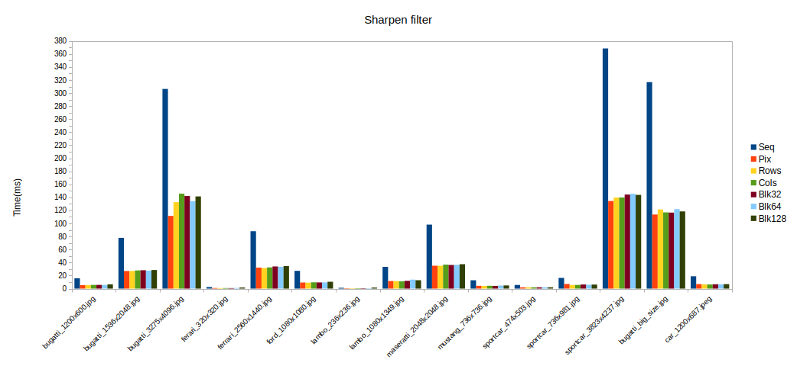
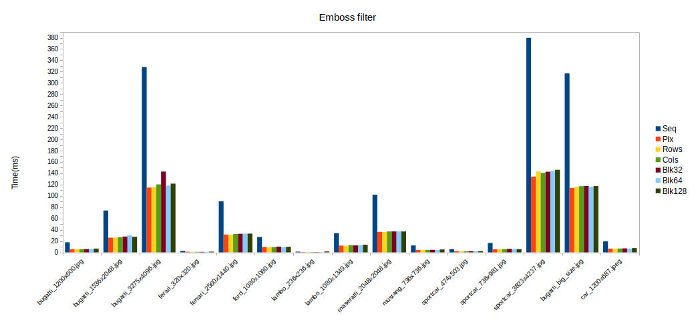
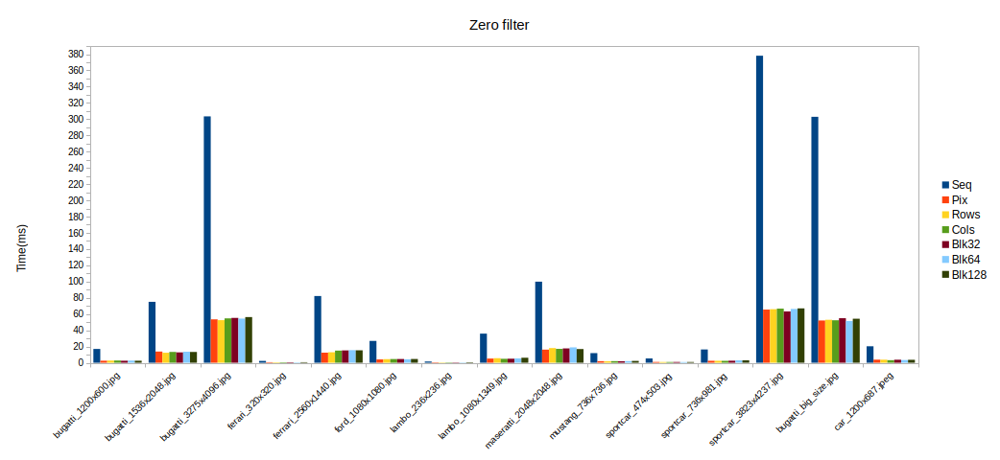

# Convolution Image Filtering (C)

Проект реализует **ручную свёртку (convolution)** для фильтрации изображений на языке C с использованием OpenCV.  
Позволяет применять различные фильтры и тестировать производительность.

---

## Зависимости

Перед сборкой убедитесь, что установлена следующая библиотека:

| Библиотека | Назначение | Сборка |
|------------|------------|---------------------------|
| OpenCV 3.4 | Работа с изображениями через C API | [Инструкция по сборке](https://gist.github.com/ntcuong777/081276a4d609ddfcdc7d139ad02206f9) |


---

## Сборка и запуск (Makefile)

Проект использует `make` для сборки.

### Доступные цели

| Команда | Описание |
|---------|----------|
| `make build` | скомпилировать основную программу |
| `make test` | скомпилировать и запустить тесты |
| `make clean` | удалить папку `build/` |

### Аргументы командной строки

| Флаг | Длинная форма | Описание |
|------|---------------|----------|
| `-f` | `--filter` | ID фильтра (0-14) |
| `-t` | `--tactic` | Стратегия параллелизации (0-6) |
| `-s` | `--src` | Путь к исходному изображению |
| `-o` | `--out` | Путь для сохранения результата |

### ID фильтров

| ID | Фильтр | Описание |
|----|--------|----------|
| 0 | `blur3x3` | Размытие 3×3 (крест) |
| 1 | `blur5x5` | Размытие 5×5 (ромб) |
| 2 | `gaussian3x3` | Гауссово размытие 3×3 |
| 3 | `gaussian5x5` | Гауссово размытие 5×5 |
| 4 | `motionblur` | Размытие в движении 9×9 |
| 5 | `findedges1` | Детектор границ (вертикальный) |
| 6 | `findedges2` | Детектор границ (усиленный) |
| 7 | `findedges3` | Детектор границ (диагональный) |
| 8 | `findedges4` | Детектор границ (Лапласиан) |
| 9 | `sharpen1` | Повышение резкости 3×3 |
| 10 | `sharpen2` | Повышение резкости 5×5 |
| 11 | `sharpen3` | Повышение резкости (инверсия) |
| 12 | `emboss1` | Тиснение 3×3 |
| 13 | `emboss2` | Тиснение 5×5 |
| 14 | `identity` | Тождественный фильтр (без изменений) |

### Стратегии параллелизации

| ID | Стратегия | Описание |
|----|-----------|----------|
| 0 | `sequential` | Последовательная обработка |
| 1 | `pixelwise` | Попиксельное распределение |
| 2 | `by_rows` | Разделение по строкам |
| 3 | `by_cols` | Разделение по столбцам |
| 4 | `blocks_32` | Блоки 32×32 |
| 5 | `blocks_64` | Блоки 64×64 |
| 6 | `blocks_128` | Блоки 128×128 |

### Пример сборки и запуска

```bash
# Клонирование репозитория
git clone https://github.com/Life-enjoyer7/Foto-Filter.git
cd Foto-Filter

# Сборка основной программы
make build

# Запуск с аргументами командной строки
./build/filter -f 2 -t 2 -s images/input.jpg -o images/output.jpg

# Сборка и запуск тестов
make test

```
 
 ---


## Анализ производительности


### Identity Filter


**Среднее ускорение относительно последовательной версии (Seq):**

| Стратегия | Среднее ускорение |
|-----------|-------------------|
| **По строкам (Rows)** | **6.00x** |
| По столбцам (Cols) | 5.94x |
| Попиксельно (Pix) | 5.91x |
| Блоки 64×64 (Blk64) | 5.91x |
| Блоки 32×32 (Blk32) | 5.82x |
| Блоки 128×128 (Blk128) | 5.77x |

#### Ключевые наблюдения

1. **Лучшая стратегия:** Разделение по строкам (`Rows`) показывает наилучшую производительность со средним ускорением **6.00x**.

2. **Стабильность методов:** Большинство стратегий демонстрируют ускорение в диапазоне 5.77x–6.00x, что говорит о хорошей масштабируемости на 8-ядерном процессоре.

3. **Наихудший результат у Blk128:** Крупные блоки 128×128 дают наименьшее ускорение (5.77x) из-за меньшего количества блоков и неравномерной нагрузки на потоки.

---

### Shift Composition

#### Left - Right




**Среднее ускорение относительно последовательной версии (Seq):**

| Стратегия | Среднее ускорение |
|-----------|-------------------|
| **По строкам (Rows)** | **5.80x** |
| Попиксельно (Pix) | 5.80x |
| Блоки 32×32 (Blk32) | 5.80x |
| По столбцам (Cols) | 5.77x |
| Блоки 128×128 (Blk128) | 5.75x |
| Блоки 64×64 (Blk64) | 5.73x |

#### Ключевые наблюдения

1. **Лучшая стратегия:** Стратегии `Rows`, `Pix` и `Blk32` демонстрируют наивысшее среднее ускорение — **5.80x**.

2. **Разброс результатов:** Разница между лучшей и худшей стратегией составляет всего 0.07x (5.80x vs 5.73x), что говорит о стабильности всех реализаций.

3. **Наихудший результат у Blk64:** Блоки 64×64 показывают наименьшее ускорение (5.73x), что может быть связано с особенностями балансировки нагрузки для данного паттерна доступа.

---

#### Up - Down


**Среднее ускорение относительно последовательной версии (Seq):**

| Стратегия | Среднее ускорение |
|-----------|-------------------|
| Попиксельно (Pix) | **5.96x** |
| По столбцам (Cols) | 5.91x |
| Блоки 128×128 (Blk128) | 5.87x |
| Блоки 32×32 (Blk32) | 5.81x |
| По строкам (Rows) | 5.79x |
| Блоки 64×64 (Blk64) | 5.72x |

#### Ключевые наблюдения

1. **Лучшая стратегия:** Попиксельное распределение (`Pix`) неожиданно показывает наилучшее среднее ускорение — **5.96x**.

2. **Столбцы эффективнее строк:** В тесте `Up-Down` разделение по столбцам (5.91x) ожидаемо опережает разделение по строкам (5.79x), так как сдвиг по вертикали обеспечивает более последовательный доступ к памяти при обходе по столбцам.

3. **Наихудший результат у Blk64:** Стратегия с блоками 64×64 показывает наименьшее ускорение (5.72x), уступая даже более крупным блокам 128×128 (5.87x).

---

#### Diag


**Среднее ускорение относительно последовательной версии (Seq):**

| Стратегия | Среднее ускорение |
|-----------|-------------------|
| **Блоки 32×32 (Blk32)** | **5.90x** |
| По строкам (Rows) | 5.89x |
| Блоки 64×64 (Blk64) | 5.86x |
| По столбцам (Cols) | 5.74x |
| Попиксельно (Pix) | 5.69x |
| Блоки 128×128 (Blk128) | 5.65x |

#### Ключевые наблюдения

1. **Лучшая стратегия:** Блоки 32×32 (`Blk32`) показывают наилучшее среднее ускорение — **5.90x**.

2. **Паритет лидеров:** Стратегии `Rows` (5.89x) и `Blk64` (5.86x) показывают результаты, близкие к лидеру.

3. **Наихудший результат у Blk128:** Крупные блоки 128×128 дают наименьшее ускорение (5.65x), подтверждая тенденцию снижения эффективности при чрезмерном укрупнении блоков.

---

### Zero Padding Tests

#### Blur 3x3




**Среднее ускорение относительно последовательной версии (Seq):**

| Стратегия | Среднее ускорение |
|-----------|-------------------|
| **Попиксельно (Pix)** | **2.74x** |
| По строкам (Rows) | 2.67x |
| По столбцам (Cols) | 2.65x |
| Блоки 32×32 (Blk32) | 2.59x |
| Блоки 64×64 (Blk64) | 2.56x |
| Блоки 128×128 (Blk128) | 2.48x |

#### Ключевые наблюдения

1. **Лучшая стратегия:** Попиксельное распределение (`Pix`) показывает наилучшее среднее ускорение — **2.74x**.

2. **Проблема крупных блоков:** Все блочные стратегии уступают гранулярным методам, причём `Blk128` показывает наихудший результат (2.48x).

3. **Существенное отставание:** Разница между лидером (`Pix` — 2.74x) и аутсайдером (`Blk128` — 2.48x) составляет 0.26x — одно из самых заметных отставаний среди всех тестов.

---

#### Gaussian 3x3


**Среднее ускорение относительно последовательной версии (Seq):**

| Стратегия | Среднее ускорение |
|-----------|-------------------|
| **Попиксельно (Pix)** | **2.76x** |
| Блоки 64×64 (Blk64) | 2.65x |
| Блоки 128×128 (Blk128) | 2.56x |
| По строкам (Rows) | 2.56x |
| По столбцам (Cols) | 2.54x |
| Блоки 32×32 (Blk32) | 2.52x |

#### Ключевые наблюдения

1. **Лучшая стратегия:** Попиксельное распределение (`Pix`) показывает наилучшее среднее ускорение — **2.76x**.

2. **Стабильность методов:** Все стратегии демонстрируют ускорение в узком диапазоне 2.52x–2.76x.

3. **Наихудший результат у Blk32:** Наименьшее ускорение показывают блоки 32×32 (2.52x), а не традиционно отстающие крупные блоки. Причина кроется в том, что мелкие блоки создают больше накладных расходов на переключение потоков.

---

#### Find Edges 1




**Среднее ускорение относительно последовательной версии (Seq):**

| Стратегия | Среднее ускорение |
|-----------|-------------------|
| Попиксельно (Pix) | **3.65x** |
| По строкам (Rows) | 3.55x |
| По столбцам (Cols) | 3.49x |
| Блоки 32×32 (Blk32) | 3.48x |
| Блоки 128×128 (Blk128) | 3.43x |
| Блоки 64×64 (Blk64) | 3.41x |

#### Ключевые наблюдения

1. **Лучшая стратегия:** Попиксельное распределение (`Pix`) показывает наилучшее среднее ускорение — **3.65x**.

2. **Полный паритет:** Все стратегии показали близкое ускорение (3.41x–3.65x), разница между лучшей и худшей стратегией составляет 0.24x.

3. **Наихудший результат у Blk64:** Блоки 64×64 показывают наименьшее ускорение (3.41x), незначительно отставая от других стратегий.

---

#### Sharpen 1




**Среднее ускорение относительно последовательной версии (Seq):**

| Стратегия | Среднее ускорение |
|-----------|-------------------|
| Попиксельно (Pix) | **2.77x** |
| По строкам (Rows) | 2.61x |
| По столбцам (Cols) | 2.54x |
| Блоки 32×32 (Blk32) | 2.53x |
| Блоки 64×64 (Blk64) | 2.53x |
| Блоки 128×128 (Blk128) | 2.49x |

#### Ключевые наблюдения

1. **Лучшая стратегия:** Попиксельное распределение (`Pix`) показывает наилучшее среднее ускорение — **2.77x**.

2. **Значительный отрыв лидера:** `Pix` опережает ближайшего преследователя (`Rows` — 2.61x) на 0.16x, что является заметным преимуществом.

3. **Наихудший результат у Blk128:** Крупные блоки 128×128 традиционно показывают наихудший результат (2.49x).

---

#### Emboss 1




**Среднее ускорение относительно последовательной версии (Seq):**

| Стратегия | Среднее ускорение |
|-----------|-------------------|
| **Попиксельно (Pix)** | **2.84x** |
| По строкам (Rows) | 2.77x |
| По столбцам (Cols) | 2.73x |
| Блоки 64×64 (Blk64) | 2.71x |
| Блоки 128×128 (Blk128) | 2.66x |
| Блоки 32×32 (Blk32) | 2.59x |

#### Ключевые наблюдения

1. **Лучшая стратегия:** Попиксельное распределение (`Pix`) показывает наилучшее среднее ускорение — **2.84x**.

2. **Градиент эффективности:** Наблюдается плавное снижение ускорения: Pix (2.84x) → Rows (2.77x) → Cols (2.73x) → блоки (2.59x–2.71x).

3. **Наихудший результат у Blk32:** Наименьшее ускорение показывают блоки 32×32 (2.59x), а не более крупные блоки.

---

### Zero Filter




**Среднее ускорение относительно последовательной версии (Seq):**

| Стратегия | Среднее ускорение |
|-----------|-------------------|
| Попиксельно (Pix) | **5.86x** |
| По строкам (Rows) | 5.81x |
| По столбцам (Cols) | 5.73x |
| Блоки 32×32 (Blk32) | 5.72x |
| Блоки 64×64 (Blk64) | 5.69x |
| Блоки 128×128 (Blk128) | 5.58x |

#### Ключевые наблюдения

1. **Лучшая стратегия:** Попиксельное распределение (`Pix`) показывает наилучшее среднее ускорение — **5.86x**.

2. **Стабильная масштабируемость:** Все стратегии демонстрируют ускорение в диапазоне 5.58x–5.86x, что подтверждает эффективность параллельной обработки на современных многоядерных системах.

3. **Наихудший результат у Blk128:** Крупные блоки 128×128 традиционно показывают наихудший результат (5.58x), отставая от лидера на 0.28x.